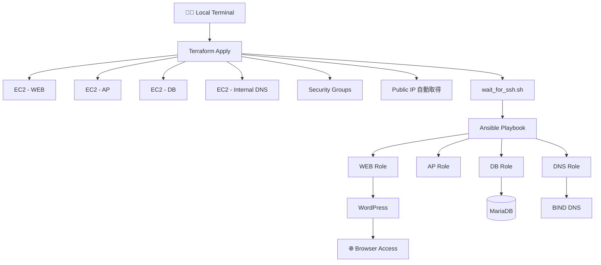
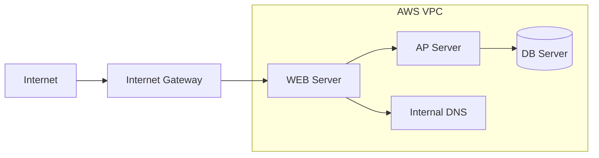
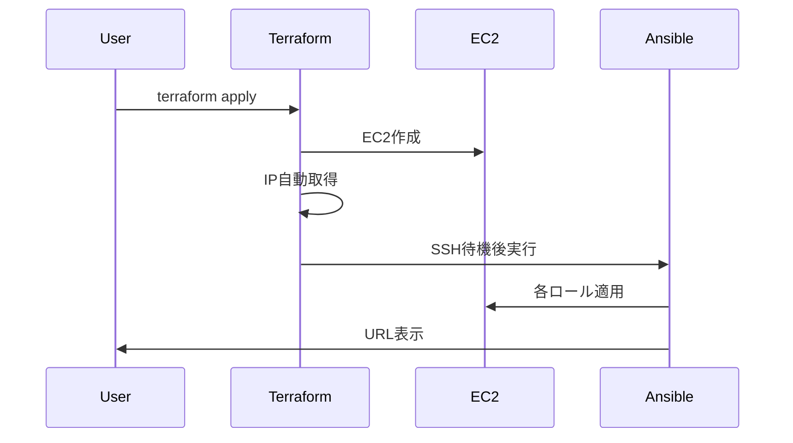

# Terraform + Ansible 自動構築環境
</br>

## 🎯 目的
本プロジェクトは、Terraform と Ansible を用いて  
以下の構成を **完全自動構築すること** を目的としています。

### 構成
- WEB サーバ（Apache + WordPress）
- AP サーバ
- DB サーバ（MariaDB）
- 内部 DNS サーバ

Terraform で AWS インフラを構築し、  
Ansible によって各サーバのセットアップを自動実行します。

---
</br>
</br>


## 🏗 アーキテクチャ
```
Terraform
├── EC2 × 4台 作成
├── SecurityGroup 作成
├── 実行端末のグローバルIPを自動取得
└── Ansible 実行

Ansible
├── WEBロール
├── APロール
├── DBロール
└── 内部DNSロール
```

---
</br>
</br>


## 🌍 ネットワーク構成図

---
</br>
</br>


## 🔄 実行フロー

---
</br>
</br>


## 🖥 必要環境
### ローカル環境
- macOS / Linux
- Terraform >= 1.5
- Ansible >= 2.12
- OpenSSH
- AWS CLI（認証済み）

### AWS 側
- IAMユーザー（EC2作成権限あり）
- キーペア（例: `kurosawa_terraform.pem`）
---
</br>
</br>


## ⚙ 事前セットアップ
### 1️⃣ AWS 認証
```bash
aws configure
または
export AWS_PROFILE=xxx
```

### 2️⃣ SSH鍵確認
```bash
ls ~/.ssh/kurosawa_terraform.pem
chmod 600 ~/.ssh/kurosawa_terraform.pem
```

### 3️⃣ 実行端末IP自動取得機能
本プロジェクトでは、
```bash
https://checkip.amazonaws.com
```
を利用して、実行端末のグローバルIPを取得し、

SecurityGroup の SSH許可IP として自動設定します。

固定IPを利用したい場合は：
```bash
terraform apply -var="my_ip_cidr=xxx.xxx.xxx.xxx/32"
```
---
</br>
</br>


## 🚀 実行手順
【前提】
```
terraformディレクトリに移動すること。
```

① 初期化
```bash
terraform init
```

② プラン確認
```bash
terraform plan
```

③ インフラ構築
```bash
terraform apply -auto-approve
```

④ Ansible実行（構築含む）
```bash
terraform apply -auto-approve -var="run_after_apply=true"
```
---
</br>
</br>


## ⏳ SSH待機処理
EC2起動直後は SSH がまだリッスンしていない場合があります。

そのため以下の処理を実装しています：
```bash
wait_for_ssh.sh
```
22番ポートが開くまで待機してから Ansible を実行します。

---
</br>
</br>


## 🌐 動作確認

apply 完了後、ターミナルに以下が表示されます。

```bash
🚀 Deployment Completed Successfully!

WordPress URL:
http://<WEB_PUBLIC_IP>/

Admin:
http://<WEB_PUBLIC_IP>/wp-admin/
```

ブラウザでアクセスしてください。

---
</br>
</br>


## 🔍 トラブルシューティング
**SSH Connection refused**

→ EC2起動直後の可能性

→ wait_for_ssh が動作しているか確認

---

**SSH timeout**

→ SecurityGroup の IP 制限を確認

→ terraform output my_ip_cidr_effective で確認

---

**Ansible unreachable**

→ inventory のIP確認

→ 手動SSHで疎通確認

---
</br>
</br>


## 🧹 破棄
作成したEC2やセキュリティグループを削除します。
```bash
terraform destroy -auto-approve
```
---
</br>
</br>


## 📁 ディレクトリ構成
```bash
terraform/
 ├── main.tf
 ├── variables.tf
 ├── outputs.tf
 ├── ip_auto.tf
 ├── ansible/
 │    ├── inventory/
 │    ├── roles/
 │    └── site.yml
 └── scripts/
      ├── update_ansible_files.sh
      └── wait_for_ssh.sh
```
---
</br>
</br>


## 🧠 設計思想
- Terraform apply 中に terraform output を再実行しない設計
- 環境変数による IP 受け渡し
- SSH待機による安定実行
- 成功時のみURL表示（set -e）
---
</br>
</br>


## 🔒 セキュリティ
- SSH は実行端末IPのみ許可
- 固定IP指定可能
- StrictHostKeyChecking 無効化（開発用）
---
</br>
</br>


